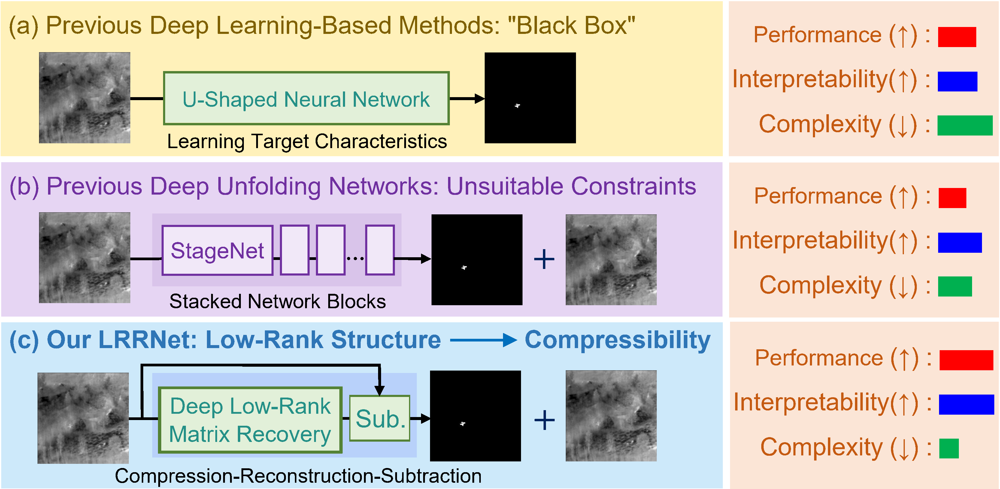
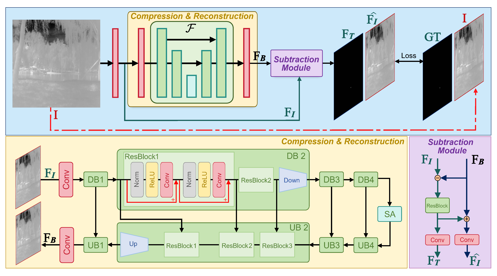

# ✨  It’s Not the Target, It’s the Background: Rethinking Infrared Small Target Detection via Deep Patch-Free Low-Rank Representations


> **Authors:** Zhang, Guoyi and Xu, Guangsheng and Chen, Siyang and Wang, Han and Zhang, Xiaohu  
> Official implementation of "**LRRNet**".

---

## 📜 Table of Contents

- [Abstract](#-abstract)
- [News](#-news)
- [Installation](#-installation)
- [Dataset Preparation](#-dataset-preparation)
- [Training](#-training)
- [Testing](#-testing)
- [Future Work](#-future-work)
- [Acknowledgements](#-acknowledgements)
- [Citation](#-citation)

---

## 🚀 Abstract


Comparison of the proposed LRRNet with existing data-driven methods.

This design is based on **a key insight**: the low-rank nature of infrared images implies an inherent compressibility---when the rank is sufficiently small, the image information can be sparsely encoded while being nearly ''losslessly'' preserved. 

To the best of our knowledge, this is the **first** work to directly learn low-rank background structures using deep neural networks in an end-to-end manner.

Extensive experiments on multiple public datasets demonstrate that LRRNet outperforms 38 state-of-the-art methods in terms of detection accuracy, robustness, and computational efficiency. Remarkably, it achieves real-time performance with an average speed of 82.34 FPS (on an NVIDIA 3080Ti GPU with an input resolution of 512 × 512 and a batch size of 1). Evaluations on the challenging NoisySIRST dataset further confirm the model’s resilience to sensor noise.


---

## 🏆 News
#### 1. Our LRRNet has been accepted for publication in IEEE Transactions on Geoscience and Remote Sensing (TGRS). The link is as follows: [LRRNet](https://ieeexplore.ieee.org/document/11156113)
#### 2. Since our original implementation was developed for an internal project, we re-implemented a version of LRRNet based on the [DPCANet](https://github.com/GrokCV/DRPCA-Net) code framework. We tested this version on the IRSTD-1K dataset, and the results are consistent with those reported in the manuscript (mIoU: 72.39 vs. 72.36). Due to project commitments, I will soon be traveling for work and therefore have not conducted evaluations on additional datasets. This re-implemented version may still contain some bugs, and we sincerely welcome any feedback.
#### 3. We further extend our method to the multi-frame setting and develop a theoretically grounded deep-learning framework for moving small-target detection. The framework minimizes reliance on specific target or motion characteristics, thereby enhancing its adaptability. We validate the proposed approach on two tasks—multi-frame infrared small-target detection and space-debris monitoring—and establish new state-of-the-art results. The manuscript has been submitted to arXiv. [TenRPCANet](https://arxiv.org/pdf/2509.07654?)
#### 4. Due to my upcoming master’s graduation, ongoing project work, thesis writing, and preparations for PhD applications, my recent activity on GitHub has been relatively limited. If you wish to contact me, please send an email to: [zhanggy57@mail2.sysu.edu.cn](mailto:zhanggy57@mail2.sysu.edu.cn).

---

## 🏗 Architecture



## 📦 Installation

### Step 1. Clone the repository

```bash
git clone https://github.com/HaLongbao/LRRNet.git
cd LRRNet
```

### Step 2. Create environment and install dependencies

```bash
conda create -n LRRNet python=3.9
conda activate LRRNet
conda install pytorch torchvision torchaudio pytorch-cuda=11.8 -c pytorch -c nvidia
pip install -r requirements.txt
```
## 📚 Dataset Preparation

### Datasets Link

We used **NUDT-SIRST**, **IRSTD-1K** and **SIRST-Aug** for both training and test.

- **NUDT-SIRST** can be found and downloaded here: [NUDT-SIRST](https://github.com/YeRen123455/Infrared-Small-Target-Detection)
- **IRSTD-1K** can be found and downloaded here: [IRSTD-1K](https://github.com/RuiZhang97/ISNet)
- **SIRST-Aug** can be found and downloaded here: [SIRST-Aug](https://github.com/Tianfang-Zhang/AGPCNet)

Note:   
    
You can also refer to [Google Drive](https://drive.google.com/file/d/1rs6ORtekqHmuPEPhyq61iPPVOxx2QF7B/view?usp=drive_link). - Wu Fengyi's settings for ready-to-use datasets.

Please first download these datasets and place NUDT-SIRST, IRSTD-1K, and sirst_aug in the folder `./datasets/`; for the SIRSTV1 dataset, please maintain its official directory structure.

### File Structure
```
├──./datasets/
│    ├── NUDT-SIRST/ & IRSTD-1k/ & sirst_aug/
│    │    ├── trainval
│    │    │    ├── images
│    │    │    │    ├── 000002.png
│    │    │    │    ├── 000004.png
│    │    │    │    ├── ...
│    │    │    ├── masks
│    │    │    │    ├── 000002.png
│    │    │    │    ├── 000004.png
│    │    │    │    ├── ...
│    │    ├── test
│    │    │    ├── images
│    │    │    │    ├── 000001.png
│    │    │    │    ├── 000003.png
│    │    │    │    ├── ...
│    │    │    ├── masks
│    │    │    │    ├── 000001.png
│    │    │    │    ├── 000003.png
│    │    │    │    ├── ...
```

Please make sure that the path of your data set is consistent with the `data_root`.

---

## 🏋️‍♂️ Training

Run`run_configs.py` to perform network training:
```bash
$ python run_configs.py
```
In the `run_configs.py` file, by setting parameters such as data_irstd1k, data_sirstaug, data_nudt, and SirstDataset, you can respectively run the corresponding datasets for training.

## 🔍 Testing

Run `inference.py` to generate file of the format .mat and .png:
```bash
$ python inference.py
```
In the inference.py script, you can perform inference on different datasets by specifying the dataset_name parameter with one of the following options: NUDT-SIRST, IRSTD-1k, sirst_aug, or SIRSTv1. Each value corresponds to a specific dataset configuration.

Result files (.png and .mat) will be saved to:
```
├──./results/
│    ├── [dataset_name]
│    │   ├── img
│    │   │    ├── 000000.png
│    │   │    ├── 000001.png
│    │   │    ├── ...
│    │   ├── mat
│    │   │    ├── 000000.mat
│    │   │    ├── 000001.mat
│    │   │    ├── ...
```
Run `cal_from_mask.py` for direct evaluation:
```bash
$ python cal_from_mask.py
```
In the cal_from_mask.py file, you can calculate metrics such as mIoU, F1, Pd, and Fa for the inference results of corresponding datasets by setting the data_list parameter to one of the following values: NUDT-SIRST, IRSTD-1k, sirst_aug.

### Model Zoo

The `checkpoints` folder contains the weights for four datasets.

## 🚀 Future Work
### 1. Exploring Deep Supervision. 
This point has already been addressed in the Limitations section of the manuscript.
### 2. Dynamic Loss Function Weights. 
We recently found that adjusting the weights of the SoftIoU, L1, and MSE losses can lead to results significantly better than those reported in the manuscript (≈ mIoU + 1.76). From a regularization perspective, the contributions of these three losses can be analyzed to understand their respective constraints on the final detection. Notably, this implicitly reflects assumptions about the underlying data distribution. 
**Particularly**, our [recent work](https://arxiv.org/pdf/2511.13013) indicates that starting from the standard backpropagation framework, introducing extremely minor modifications can lead to significant performance improvements.

### 3. More Explicit Low-Rank Constraints
We observe a subtle connection between low-rank completion and MAE-based self-supervision, suggesting that incorporating more explicit low-rank constraints is a promising direction for future exploration. Leveraging this relationship may further enhance the model’s ability to capture structural correlations and improve detection performance.

### 4. More Effective Subtraction Operation

#### In LRRNet, the subtraction is overly aggressive. In particular, due to the asymmetry of ReLU and other activation functions between positive and negative responses, excessive subtraction can directly lead to information loss.

---


## 📄 Acknowledgements

#### We would like to thank the authors of [RPCANet](https://github.com/fengyiwu98/RPCANet) and [DRPCANet](https://github.com/GrokCV/DRPCA-Net) for releasing their code, which greatly facilitated our implementation. We also appreciate the contributions of [IPI](https://ieeexplore.ieee.org/document/6595533) to infrared small target detection.

---

## 📄 Citation

If you find this paper useful, please cite it as:
```bibtex
@ARTICLE{LRRNet,
  author={Zhang, Guoyi and Xu, Guangsheng and Chen, Siyang and Wang, Han and Zhang, Xiaohu},
  journal={IEEE Transactions on Geoscience and Remote Sensing}, 
  title={It’s Not the Target, It’s the Background: Rethinking Infrared Small-Target Detection via Deep Patch-Free Low-Rank Representations}, 
  year={2025},
  doi={10.1109/TGRS.2025.3608239}
}

@article{zhang2025beyond,
  title={Beyond Motion Cues and Structural Sparsity: Revisiting Small Moving Target Detection},
  author={Zhang, Guoyi and Chen, Siyang and Xu, Guangsheng and Shen, Zhihua and Wang, Han and Zhang, Xiaohu},
  journal={arXiv preprint arXiv:2509.07654},
  year={2025}
}

@article{zhang2025you,
  title={You Only Look Omni Gradient Backpropagation for Moving Infrared Small Target Detection},
  author={Zhang, Guoyi and Xu, Guangsheng and Chen, Siyang and Wang, Han and Zhang, Xiaohu},
  journal={arXiv preprint arXiv:2511.13013},
  year={2025}
}
